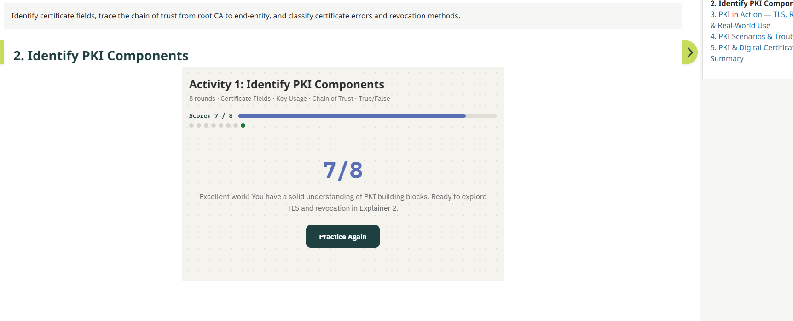
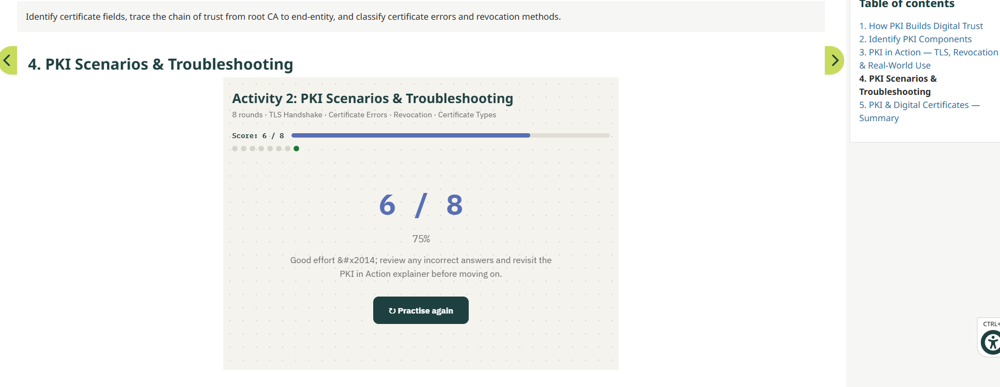
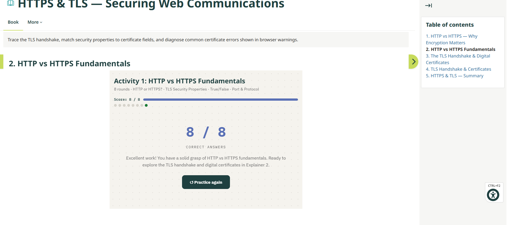
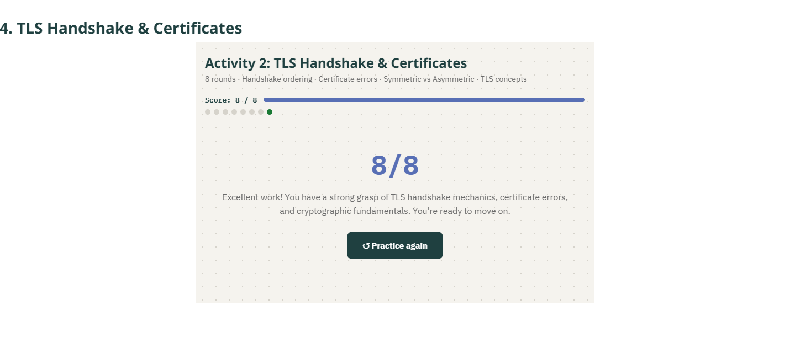
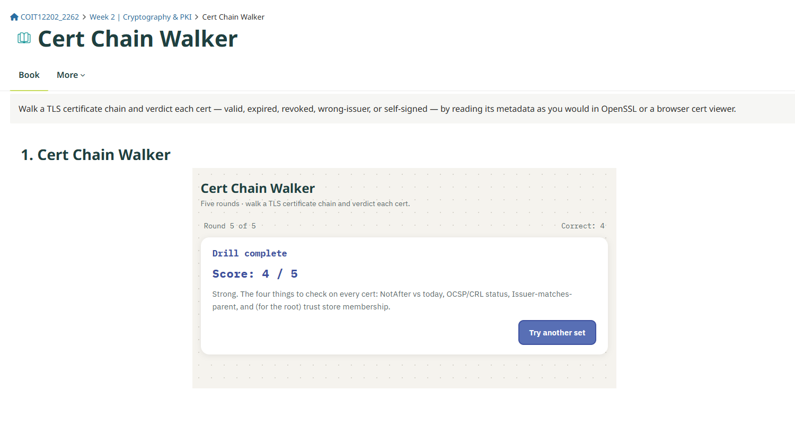
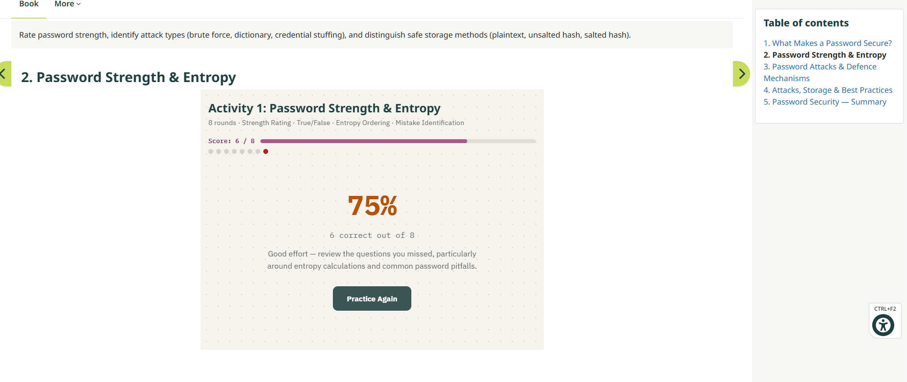
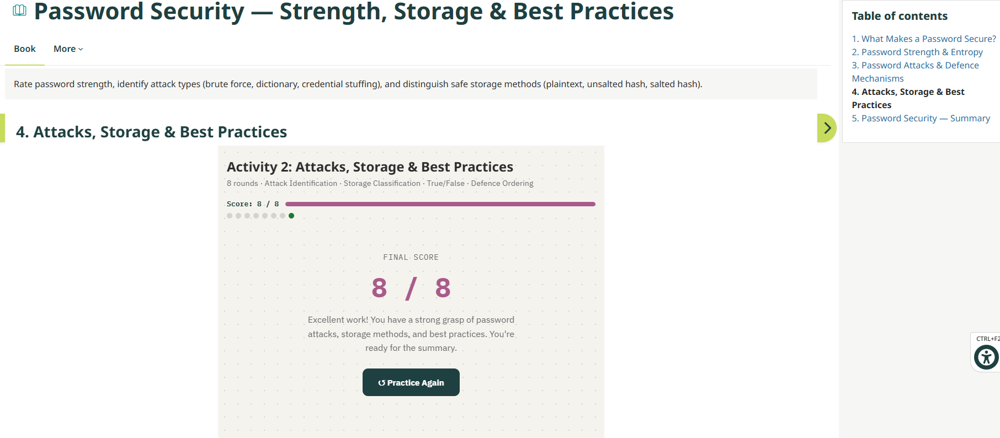
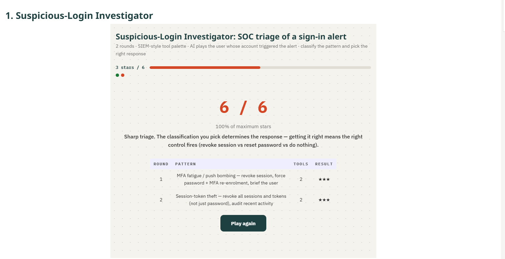

# Week-1: Network Security Architecture — Defence in Depth & Security Zones

##  Identify Zones, Devices & Boundaries

## Defence in Depth & Layered Controls

##  Phishing Triage

# Week-2:PKI & Digital Certificates — Trust, Verification & Secure Communication

## Identify PKI Components

## PKI Scenarios & Troubleshooting

# HTTPS & TLS — Securing Web Communications
## HTTP vs HTTPS Fundamentals

## TLS Handshake & Certificates

# Cert Chain Walker

# Week-3: Password Security — Strength, Storage & Best Practices
## Password Strength & Entropy

## Attacks, Storage & Best Practices

# Suspicious-Login Investigator — Triaging an Alerted Sign-In
## Suspicious-Login Investigator

# WEEK-4: SSH Protocol — Secure Remote Access & Tunnelling
##  SSH Foundations

##  SSH in Practice

